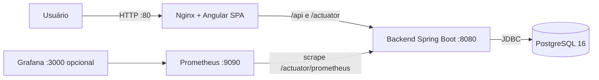

# SRE Operations Dashboard

Aplicação full stack demonstrativa para gerenciamento de serviços monitorados, construída para apresentar conceitos de **SRE**: health checks, métricas, containers, automação de deploy e observabilidade.

## Objetivo

Permitir o cadastro e acompanhamento de serviços (nome, ambiente, URL e status UP / DEGRADED / DOWN), com um resumo agregado no dashboard e observabilidade via Spring Boot Actuator e Prometheus.

## Arquitetura



- **Nginx** serve o Angular e faz proxy reverso de `/api/` e `/actuator/` para o backend (o PostgreSQL e o backend não são expostos à internet).
- **Backend** expõe API REST, health checks e métricas Prometheus.
- **Flyway** cria o schema e insere três serviços demonstrativos na primeira inicialização.

## Tecnologias

| Camada | Tecnologia |
|---|---|
| Backend | Java 21, Spring Boot 3.4, Spring Web, Spring Data JPA, Bean Validation, Actuator, Micrometer Prometheus, Flyway |
| Frontend | Angular 20 (standalone components), TypeScript, CSS puro |
| Banco | PostgreSQL 16 |
| Infra | Docker, Docker Compose, Nginx (imagem unprivileged), Prometheus, Grafana (opcional) |
| CI | GitHub Actions |

## Estrutura de diretórios

```text
.
├── .github/workflows/ci.yml    # CI: build + testes do backend, build do frontend, validação do compose
├── backend/                    # API Spring Boot (controller/service/repository/entity/dto/exception/config)
├── frontend/                   # SPA Angular + nginx.conf
├── monitoring/prometheus.yml   # Configuração de scrape do Prometheus
├── scripts/check.sh            # Verificação de saúde da stack
├── scripts/deploy.sh           # Deploy automatizado (build + up + smoke tests)
├── docker-compose.yml
├── Makefile
└── .env.example
```

## Pré-requisitos

- Docker e Docker Compose (única exigência para rodar tudo em containers)
- Para desenvolvimento local sem Docker: Java 21, Maven 3.9+, Node.js 22+

## Execução com Docker Compose (recomendado)

```bash
cp .env.example .env       # ajuste POSTGRES_PASSWORD
docker compose up -d --build
```

Verificação:

```bash
docker compose ps
curl http://localhost/actuator/health
curl http://localhost/api/services
```

URLs:

| URL | Descrição |
|---|---|
| http://localhost | Dashboard (Angular via Nginx) |
| http://localhost/api/services | API REST |
| http://localhost/actuator/health | Health check |
| http://localhost:9090 | Prometheus |
| http://localhost:3000 | Grafana (opcional, perfil `grafana`) |

Grafana (opcional): `docker compose --profile grafana up -d` — usuário `admin`, senha definida em `GRAFANA_ADMIN_PASSWORD` (padrão de desenvolvimento: `admin`).

## Execução local (sem Docker para app)

```bash
make dev                        # sobe só o PostgreSQL
cd backend && mvn spring-boot:run
cd frontend && npm install && npm start   # http://localhost:4200 com proxy para :8080
```

## Variáveis de ambiente

| Variável | Padrão | Descrição |
|---|---|---|
| `POSTGRES_DB` | `sre_dashboard` | Nome do banco |
| `POSTGRES_USER` | `sre_user` | Usuário do banco |
| `POSTGRES_PASSWORD` | — (obrigatória) | Senha do banco |
| `APP_ENVIRONMENT` | `PRODUCTION` | Ambiente exibido no dashboard |
| `CORS_ALLOWED_ORIGINS` | `http://localhost` | Origens permitidas para CORS |
| `GRAFANA_ADMIN_PASSWORD` | `admin` | Senha do Grafana (opcional) |

O backend também aceita `SPRING_DATASOURCE_URL`, `SPRING_DATASOURCE_USERNAME` e `SPRING_DATASOURCE_PASSWORD` diretamente (já preenchidas pelo compose).

## Endpoints da API

| Método | Endpoint | Descrição |
|---|---|---|
| GET | `/api/services` | Lista todos os serviços |
| GET | `/api/services/{id}` | Busca um serviço |
| POST | `/api/services` | Cadastra um serviço |
| PUT | `/api/services/{id}` | Atualiza um serviço |
| PATCH | `/api/services/{id}/status` | Altera apenas o status |
| DELETE | `/api/services/{id}` | Remove um serviço |
| GET | `/api/dashboard/summary` | Totais por status |
| GET | `/api/system/info` | Informações da aplicação |

Exemplo de payload (`POST /api/services`):

```json
{
  "name": "Payments API",
  "description": "Processamento de pagamentos",
  "environment": "PRODUCTION",
  "url": "https://payments.example.com/health",
  "status": "UP"
}
```

## Health checks

- `GET /actuator/health` — inclui verificação da conexão com o PostgreSQL (componente `db`).
- `GET /actuator/info` — metadados da aplicação.
- Docker Compose: o PostgreSQL usa `pg_isready` e o backend usa o Actuator; o frontend só sobe quando o backend está saudável.

## Métricas Prometheus

- Backend expõe `GET /actuator/prometheus` (JVM, HTTP server requests, HikariCP etc.).
- O Prometheus coleta a cada 15s (`monitoring/prometheus.yml`).
- Consulta útil no Prometheus: `http_server_requests_seconds_count`.

## Testes

```bash
make test
# ou, com Maven local:
cd backend && mvn test
```

Inclui teste unitário do service (Mockito) e teste de integração do controller (SpringBootTest + MockMvc + H2 em modo PostgreSQL + Flyway).

## Deploy no Ubuntu 24.04 (VPS)

```bash
# 1. Instalar Docker (uma vez)
curl -fsSL https://get.docker.com | sudo sh
sudo usermod -aG docker "$USER" && newgrp docker

# 2. Clonar e configurar
cd /opt
sudo git clone https://github.com/SEU-USUARIO/sre-operations-dashboard.git
sudo chown -R "$USER":"$USER" sre-operations-dashboard
cd sre-operations-dashboard
cp .env.example .env
nano .env   # defina POSTGRES_PASSWORD forte

# 3. Deploy
bash scripts/deploy.sh
# ou: docker compose up -d --build
```

Atualizações futuras: `bash scripts/deploy.sh` (faz git pull, rebuild, sobe e testa).

## Troubleshooting

```bash
docker compose ps                     # estado dos containers
docker compose logs -f backend        # logs do backend em tempo real
docker compose logs --tail 100 postgres
curl -i http://localhost/actuator/health
curl -i http://localhost/api/services
docker stats                          # CPU/memória por container
docker compose restart backend        # reinicia só o backend
docker compose down && docker compose up -d --build   # rebuild completo (dados preservados no volume)
docker volume ls                      # volumes (pgdata guarda os dados)
bash scripts/check.sh                 # verificação completa automatizada
```

## Decisões técnicas

- **Flyway** para versionamento do schema e seed dos dados demonstrativos — reprodutível em qualquer ambiente.
- **Nginx como único ponto de entrada**: frontend chama `/api` relativo (sem IP fixo); backend e banco ficam na rede interna do compose.
- **Imagens não-root**: backend roda como usuário `spring` (Temurin JRE Alpine) e o frontend usa `nginx-unprivileged`.
- **H2 em modo PostgreSQL nos testes** para rodar as migrations do Flyway sem depender de Docker no CI.
- **Sem Lombok**: evita dependência de processador de anotações e simplifica o build.
- **DTOs como records** e tratamento global de exceções com respostas JSON padronizadas.

## Limitações atuais

- Sem autenticação/autorização (fora do escopo do MVP).
- Status dos serviços é alterado manualmente (não há checagem ativa das URLs cadastradas).
- Sem HTTPS (adicionar reverse proxy com certificado na VPS, ex.: Caddy/Certbot).
- Sem paginação na listagem.

## Próximas melhorias

1. Checagem ativa e periódica das URLs cadastradas (atualização automática de status).
2. HTTPS com Let's Encrypt.
3. Dashboard no Grafana provisionado automaticamente.
4. Histórico de mudanças de status (incident timeline).
5. Deploy automático via GitHub Actions + SSH.

## Roteiro de demonstração (~5 minutos)

1. **Arquitetura** (30s): mostrar o diagrama acima — Nginx na frente, backend e banco internos, Prometheus coletando métricas.
2. **Dashboard** (30s): abrir `http://SEU-IP/` — cards de resumo e tabela de serviços.
3. **CRUD** (1min): cadastrar um serviço novo e alterar o status de outro pelo select — mostrar os cards atualizando.
4. **API** (30s): `curl -i http://localhost/api/services` e `curl http://localhost/api/dashboard/summary`.
5. **Containers** (30s): `docker compose ps` — todos `healthy`, política `unless-stopped`.
6. **Health check** (30s): `curl http://localhost/actuator/health` — mostrar o componente `db` UP.
7. **Métricas** (30s): abrir `http://SEU-IP:9090` e consultar `http_server_requests_seconds_count`.
8. **Simular incidente** (1min):
   ```bash
   docker compose stop backend     # derruba o backend
   curl -i http://localhost/api/services   # 502 — frontend mostra erro amigável
   docker compose start backend    # recuperação
   bash scripts/check.sh           # tudo verde novamente
   ```
9. **Encerrar** (30s): destacar health checks, volume persistente do PostgreSQL, deploy com um comando (`scripts/deploy.sh`) e CI no GitHub Actions.
